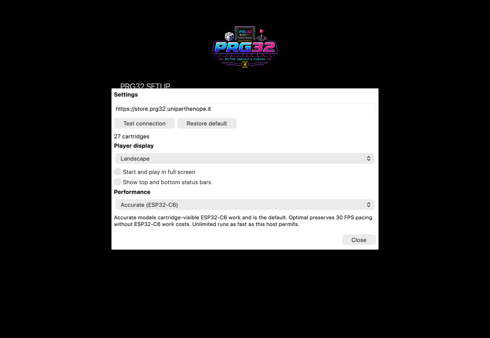
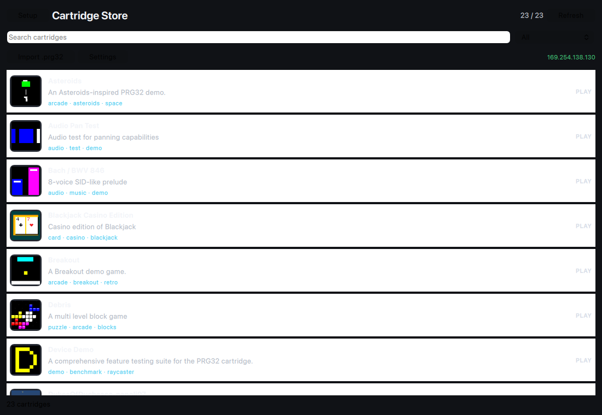
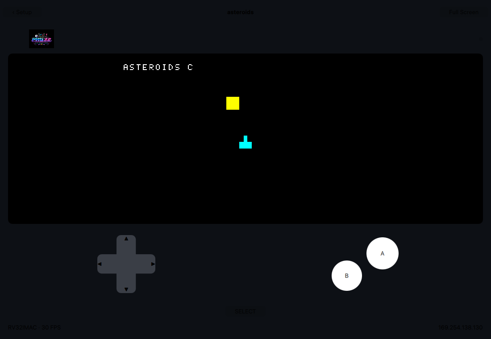
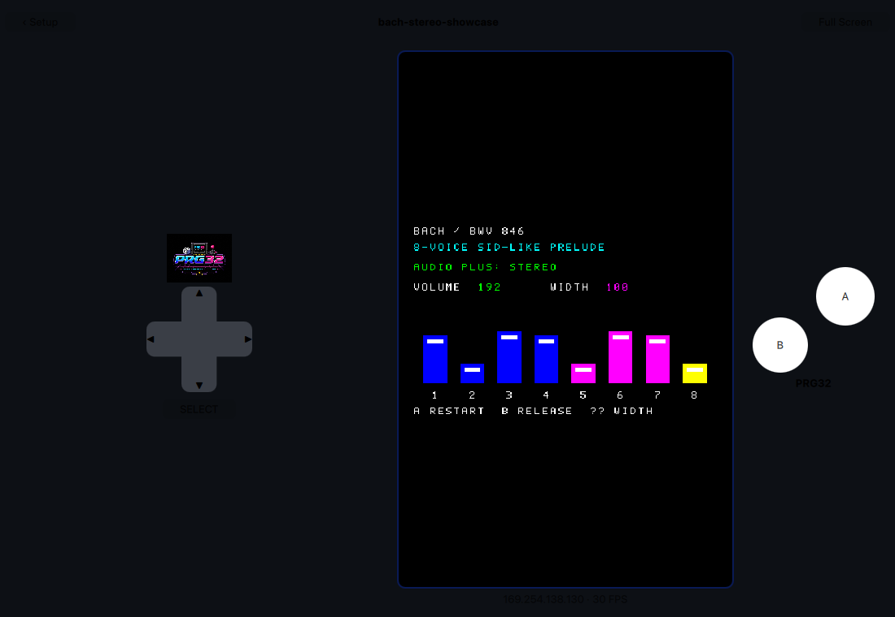
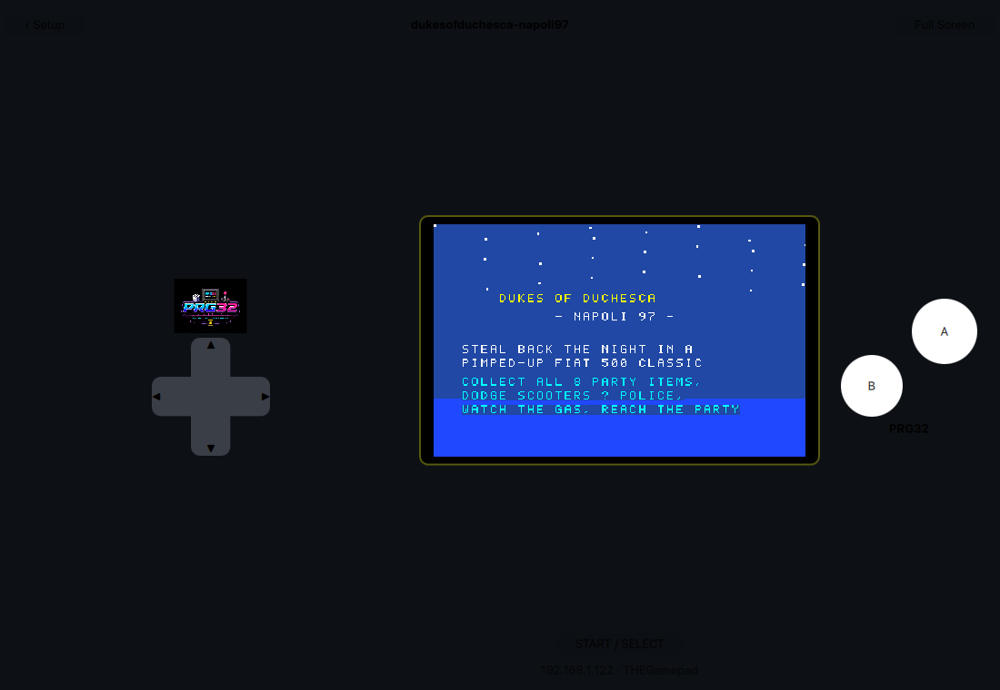
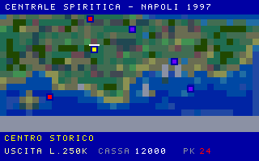
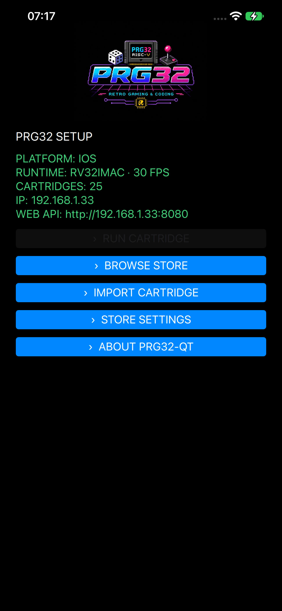
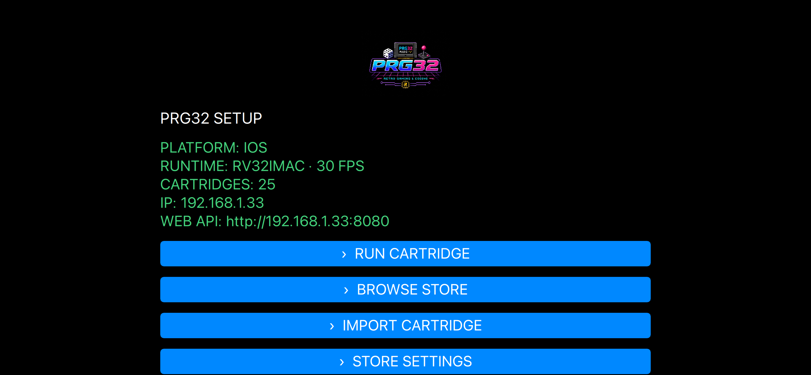
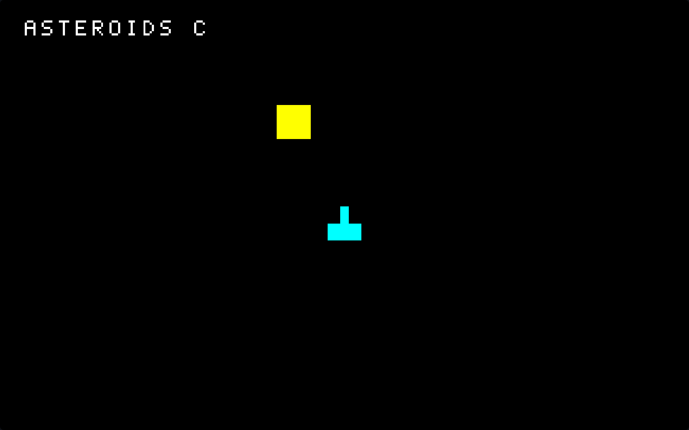

# PRG32-QT

PRG32-QT is the portable C++20 / Qt 6 host for the PRG32 cartridge ecosystem. It uses the public PRG32 cartridge ABI as its compatibility contract while sharing one Qt-free runtime across desktop, mobile, Raspberry Pi, headless tests, and Store certification.

Supported host targets are **Windows, Linux, Raspberry Pi OS/Raspbian, macOS, iOS, Android, Apple TV, and Android TV**. The default Cartridge Store is `http://193.205.230.7:5080`.

## Highlights

- PRG2 validation, CRC, ABI/import-model and feature checks.
- RV32IMAC guest execution including compressed instructions, atomics and counters used by portable cartridges.
- PRG32 ABI 1.6 (`0x260f6136`) plus documented compatible hashes.
- 320x200 indexed/RGB565 rendering, primitives, text, tiles, playfields, parallax, platform helpers, RGB565/indexed/bitplane sprites and animation.
- AUD0 samples, tones, notes, PCM, tracks, volume and stereo pan through Qt Multimedia.
- Safe-area-aware touch controls on mobile; keyboard plus hot-plug game controller support on desktop; controller-first, game-only fullscreen presentation on TV.
- RGB LED emulation, local scores, metrics/performance ABI calls and safe unavailable-service stubs.
- Store browser, search/tag filtering, Store URL settings/test, architecture-aware downloads, persistent local cartridge import, splash and adaptive portrait/landscape player UI.
- Gamer-selectable Auto, Portrait, or Landscape player layout plus persistent fullscreen TV mode (`F11`, `Control+Command+F`, or the player button; `Escape` exits).
- Canonical PRG32 artwork used by the PRG32 project.
- Headless regression fixtures included for compatibility testing and live whole-Store certification tooling.

## Build and test

Portable runtime only:

```sh
cmake -S . -B build-core -G Ninja -DPRG32QT_BUILD_APP=OFF
cmake --build build-core
ctest --test-dir build-core --output-on-failure
```

Host helpers are provided in `scripts/` for Windows, Linux, Raspberry Pi OS, macOS, iOS, Android, Apple TV and Android TV. Platform prerequisites and exact commands are documented in [docs/PLATFORMS.md](docs/PLATFORMS.md).

Versions are automatic. CMake derives a clean version from an exact `vX.Y.Z` Git tag and otherwise emits
`X.Y.Z-dev.N+gCOMMIT`, using `VERSION.txt` as the bootstrap/base version when no release tag is available. The same
derived values drive the runtime, About dialog, Android packages and Apple bundle metadata.

For an Android ARM64 debug APK with the default Qt 6.8.3 installation layout:

```sh
./scripts/build-android.sh
```

The APK is written to `build-android/android-build/build/outputs/apk/debug/android-build-debug.apk`.

To exercise every discoverable Store cartridge after building the headless runner:

```sh
python3 scripts/store-smoke.py --runner ./build-core/prg32qt-headless \
  --store http://193.205.230.7:5080 --frames 900
```

The certification input-sweeps each cartridge and records non-black rendered pixels, distinct frame hashes,
declared audio, audio-engine events, and PCM samples. Packages with no portable ABI-table variant are named
as exclusions rather than silently treated as passes.

## Player display and controls

Open **Store Settings** to choose Auto, Portrait, or Landscape independently of the window shape and, on
desktop, to make fullscreen the persistent default. iOS and Android reserve the native status/notch/home-indicator
safe area and do not offer fullscreen. On Windows, macOS, Linux, Apple TV, and Android TV fullscreen shows only the letterboxed 320x200
game area; use the keyboard or controller, and press `Escape` to return to windowed mode. Keyboard and
USB/Bluetooth controller inputs share this mapping:

| PRG32 control | Keyboard | Controller |
|---|---|---|
| Move | Arrow keys or W/A/S/D | D-pad, left stick, or HID X/Y/hat |
| A | Z or J | Button 1 / A |
| B | X or K | Button 2 / B |
| Start / Select | Return, Enter, or Space | Menu/Options or buttons 7–10 |





Portrait and landscape are explicit player choices, not merely consequences of resizing the window:

| Portrait | Landscape |
|---|---|
|  |  |

The shared Start/Select ABI control is centered below the game surface in landscape mode:



Spiriti's two-layer Naples playfield is included as a graphics regression capture:



Physical iPhone 12 Pro Max captures confirm the native safe area in both orientations:

| Portrait Setup | Landscape Setup |
|---|---|
|  |  |

Desktop fullscreen removes all player chrome and touch controls:



## Documentation

Project-level design and ownership documentation lives under `docs/`:

- [Vision](docs/VISION.md)
- [Architecture](docs/ARCHITECTURE.md)
- [iOS feature parity](docs/FEATURE_PARITY.md)
- [Platform support](docs/PLATFORMS.md)
- [Compatibility](docs/COMPATIBILITY.md)
- [Testing](docs/TESTING.md)
- [Licensing](docs/LICENSING.md)
- [Authorship](docs/AUTHORSHIP.md)
- [Third-party notices](docs/THIRD_PARTY_NOTICES.md)
- [Releasing](docs/RELEASING.md)

The repository-root `LICENSE` remains intentionally at the conventional GitHub location; licensing rationale and attribution are maintained in `docs/LICENSING.md` and `docs/AUTHORSHIP.md`.

## Contributing

See [CONTRIBUTING.md](CONTRIBUTING.md), [SECURITY.md](SECURITY.md), and [CODE_OF_CONDUCT.md](CODE_OF_CONDUCT.md). Compatibility changes should include regression coverage and, when Store behavior is affected, a whole-Store certification run.

### How this repository enforces its quality bar

The binding engineering contract is [AGENTS.md](AGENTS.md). GitHub Actions checks the repository's
authoritative `.clang-format`, documentation/code invariants, portable tests and fixture cartridges, all eight
supported build targets, and the live Cartridge Store catalog. Platform jobs call the scripts in `scripts/`, so
local and CI builds use the same entry points.
