# PRG32-QT

PRG32-QT is the portable C++20 / Qt 6 host for the PRG32 cartridge ecosystem. It uses the public PRG32 cartridge ABI as its compatibility contract while sharing one Qt-free runtime across desktop, mobile, Raspberry Pi, headless tests, and Store certification.

Supported host targets are **Windows, Linux, Raspberry Pi OS/Raspbian, macOS, iOS, Android, Apple TV, and Android TV**. The default Cartridge Store is `https://store.prg32.uniparthenope.it/`.

## Highlights

- PRG2 validation, CRC, ABI/import-model and feature checks.
- RV32IMAC guest execution including compressed instructions, atomics and counters used by portable cartridges.
- Three persistent performance profiles: Accurate ESP32-C6 timing by default, 30 FPS Optimal, and Unlimited.
- PRG32 ABI 1.6 (`0x260f6136`) plus documented compatible hashes.
- 320x200 indexed/RGB565 rendering, primitives, text, tiles, playfields, parallax, platform helpers, RGB565/indexed/bitplane sprites and animation.
- AUD0 samples, tones, notes, PCM, tracks, volume and stereo pan through Qt Multimedia.
- Safe-area-aware touch controls on mobile; keyboard plus hot-plug game controller support on desktop; controller-first, game-only fullscreen presentation on TV.
- Store-relayed multiplayer snapshots, RGB LED emulation, local scores, metrics/performance ABI calls, and
  safe unavailable-service stubs.
- Store browser, search/tag filtering, Store URL, performance and firmware-style status-bar settings,
  architecture-aware downloads, persistent local cartridge import, splash and adaptive portrait/landscape player UI.
- Gamer-selectable Auto, Portrait, or Landscape player layout plus persistent fullscreen TV mode (`F11`, `Control+Command+F`, or the player button; `Escape` exits).
- Canonical PRG32 artwork used by the PRG32 project.
- Headless regression fixtures included for compatibility testing and live whole-Store certification tooling.
- Bonjour/mDNS advertisement of the HTTP device API for SDK deployment, execution, and debugging workflows.
- Optional desktop debugger with highlighted RV32IMAC assembly, registers, guest-memory monitor, and
  pause/instruction-step/resume controls; the controls are also available to SDK/Python clients over HTTP.

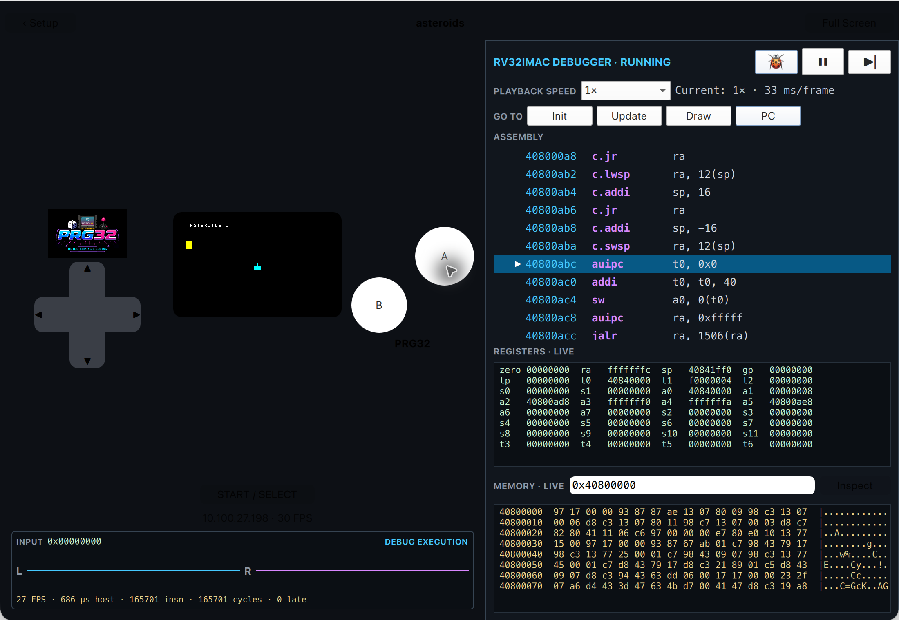

## Build and test

Portable runtime only:

```sh
cmake -S . -B build-core -G Ninja -DPRG32QT_BUILD_APP=OFF
cmake --build build-core
ctest --test-dir build-core --output-on-failure
```

Host helpers are provided in `scripts/` for Windows, Linux, Raspberry Pi OS, macOS, iOS, Android, Apple TV and Android TV. Platform prerequisites and exact commands are documented in [docs/PLATFORMS.md](docs/PLATFORMS.md).

Versions are automatic. CMake derives a clean version from an exact `vX.Y.Z` Git tag and otherwise emits
`X.Y.Z-dev.N+gCOMMIT`, using `VERSION.txt` as the bootstrap/base version when no release tag is available. The same
derived values drive the runtime, About dialog, Android packages and Apple bundle metadata.

Pushing a `vX.Y.Z` tag runs the complete release workflow. The resulting GitHub Release contains checksummed
source archives plus packaged Linux, a dependency-complete Windows installer, Apple Silicon and Intel macOS
DMG installers, Raspberry Pi OS compatibility, iOS simulator, Android APK, Android TV APK, and Apple TV builds.
CI builds the Qt 6.8.3 tvOS kit from checksum-pinned source before compiling the unsigned Apple TV simulator
application.

For an Android ARM64 debug APK with the default Qt 6.8.3 installation layout:

```sh
./scripts/build-android.sh
```

The APK is written to `build-android/android-build/build/outputs/apk/debug/android-build-debug.apk`.

Qt application builds require the Qt Multimedia and Qt WebSockets modules. Multiplayer ABI calls #32 through
#40 use the configured Store's `/api/multiplayer` WebSocket relay and share one implementation on every Qt
target.

## SDK deployment and discovery

While PRG32-QT is running, it advertises its device API as `_prg32._tcp.local.` with Bonjour/mDNS. Resolve the
service to a host and port, then pass that URL to the same PRG32 SDK workflow used for hardware:

```sh
python3 -m prg32 runtime --url http://prg32-host.local:8080
python3 -m prg32 esp32c6 upload-and-run game.prg32 \
  --url http://prg32-host.local:8080 --slot cart0
```

See [network discovery and SDK access](docs/NETWORKING.md) for the DNS-SD/TXT contract, endpoint table,
platform behavior, security boundary, and troubleshooting steps.

On desktop, enable **Run cartridges in RISC-V debug mode** in Settings, then use **Run Cartridge**. Debug mode
is off by default and persists locally. A debug launch starts running so game controls remain active; use Pause
when instruction stepping is needed. The player and debugger run side by side; Pause, Step, and Resume
operate on the same runtime used by the game. Fullscreen remains a
game-only presentation and therefore hides the debugger panel. The mutually exclusive Init, Update, Draw, and
PC selectors jump to those cartridge entry points without executing code or return to live instruction-following
mode. The current execution position is highlighted independently of the selected view. Playback
speed can be selected from 0.01x, 0.025x, 0.05x, 0.1x, 0.25x, 0.5x, 1x, 2x, or 4x while the debugger is enabled.
The PC view includes recent and upcoming instructions but visually distinguishes only the active instruction.
Debug playback executes bounded instruction slices so the PC and registers visibly advance between UI updates.
The hexadecimal/ASCII dump at the chosen guest-memory address refreshes with the same live debugger state.
The transport control displays `⏸` while running and `▶` while paused; its tooltip and accessible name expose
the corresponding Pause or Resume action. Playback-rate selection remains independent.
Click the gutter to the left of any instruction address to add a breakpoint; click its filled red circle again
to remove it. Multiple breakpoints can be active together. Execution pauses before a marked instruction retires,
and Resume skips that breakpoint once so execution can continue.
The `▶│` transport button executes exactly the highlighted instruction and stays paused. On desktop, Escape
always leaves the player/debugger and returns to Setup, including from fullscreen.
The bug toggle to the left of Play selects execution behavior without closing the debugger screen. When active,
instruction stepping and breakpoints apply; when inactive, the cartridge uses the regular frame execution path.
The telemetry frame below the virtual device reports the merged digital-input bitmask, recently rendered left
and right audio waveforms, measured host execution time, FPS, retired instructions, virtual cycles, and late frames.

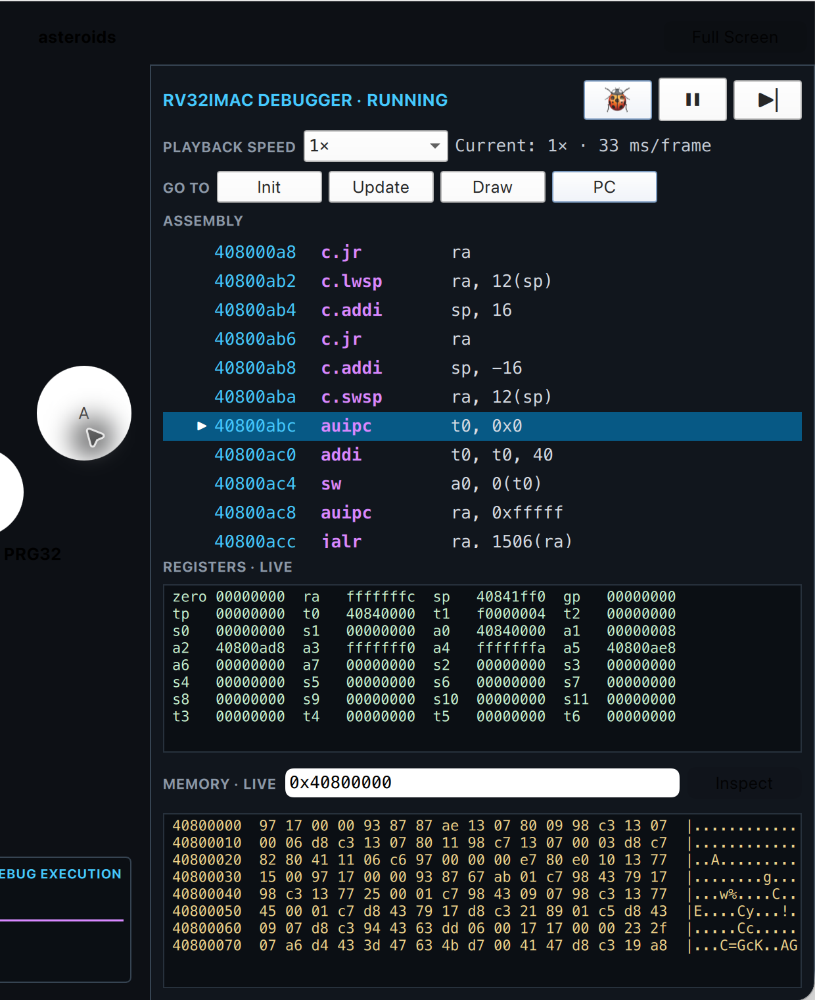

For a complete walkthrough of execution controls, assembly navigation, breakpoints, registers, memory, telemetry,
HTTP automation, and troubleshooting, see [Debugging cartridges](docs/DEBUGGING.md).

To exercise every discoverable Store cartridge after building the headless runner:

```sh
python3 scripts/store-smoke.py --runner ./build-core/prg32qt-headless \
  --store https://store.prg32.uniparthenope.it/ --frames 900
```

The certification input-sweeps each cartridge and records non-black rendered pixels, distinct frame hashes,
declared audio, audio-engine events, and PCM samples. Packages with no portable ABI-table variant are named
as exclusions rather than silently treated as passes.

## Player display and controls

Open **Settings** to choose Accurate (the ESP32-C6-oriented default), Optimal (paced at 30 FPS), or Unlimited
performance, and Auto, Portrait, or Landscape independently of the window shape and, on
desktop, to make fullscreen the persistent default. iOS and Android reserve the native status/notch/home-indicator
safe area and do not offer fullscreen. On Windows, macOS, Linux, Apple TV, and Android TV fullscreen shows only the letterboxed 320x200
game area; use the keyboard or controller. On desktop, `Escape` leaves the player and returns to Setup.
Keyboard and
USB/Bluetooth controller inputs share this mapping:

The optional top and bottom status bars reproduce the firmware's 320×240 presentation: a 20-pixel FPS band,
the unchanged 320×200 cartridge viewport, and a 20-pixel game-information band. They are disabled by default
and hidden in desktop/TV game-only fullscreen mode.

ESP32-C6 Accurate uses deterministic instruction-class and PRG32 ABI work charges at the reference firmware's
160 MHz clock and 33 ms frame cadence. It models only behavior visible to portable cartridges; it is not a full
ESP32-C6 SoC or cycle-exact microarchitecture simulation. See
[performance emulation](docs/PERFORMANCE-EMULATION.md) for counter semantics, calibration status, and limits.

| PRG32 control | Keyboard | Controller |
|---|---|---|
| Move | Arrow keys or W/A/S/D | D-pad, left stick, or HID X/Y/hat |
| A | Z or J | Button 1 / A |
| B | X or K | Button 2 / B |
| Start / Select | Return, Enter, or Space | Menu/Options or buttons 7–10 |

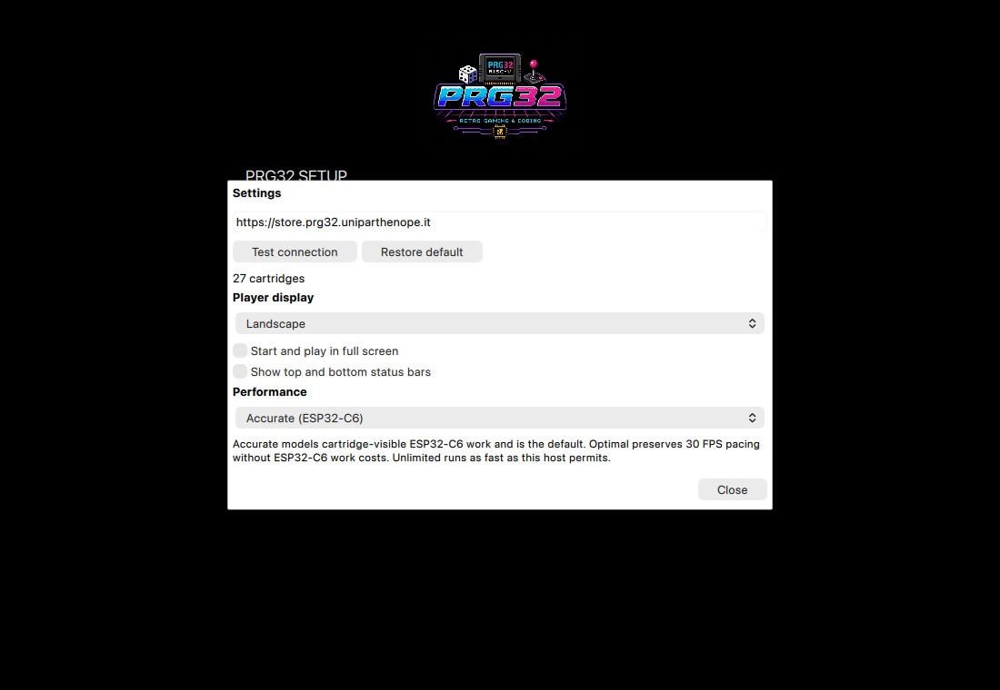

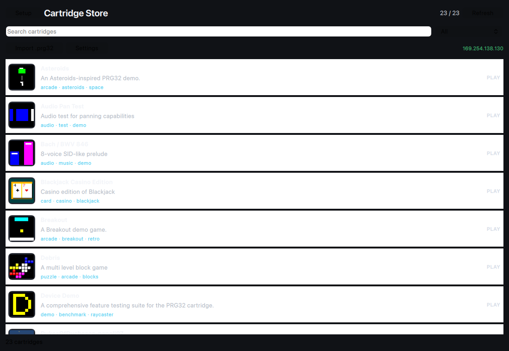

Portrait and landscape are explicit player choices, not merely consequences of resizing the window:

| Portrait | Landscape |
|---|---|
| 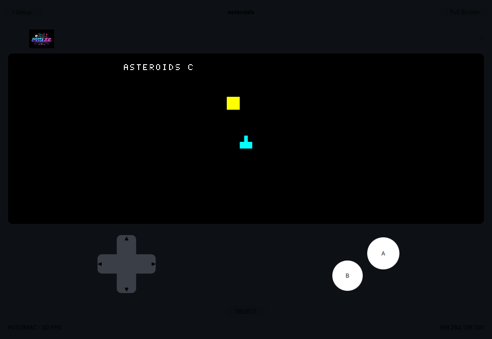 | 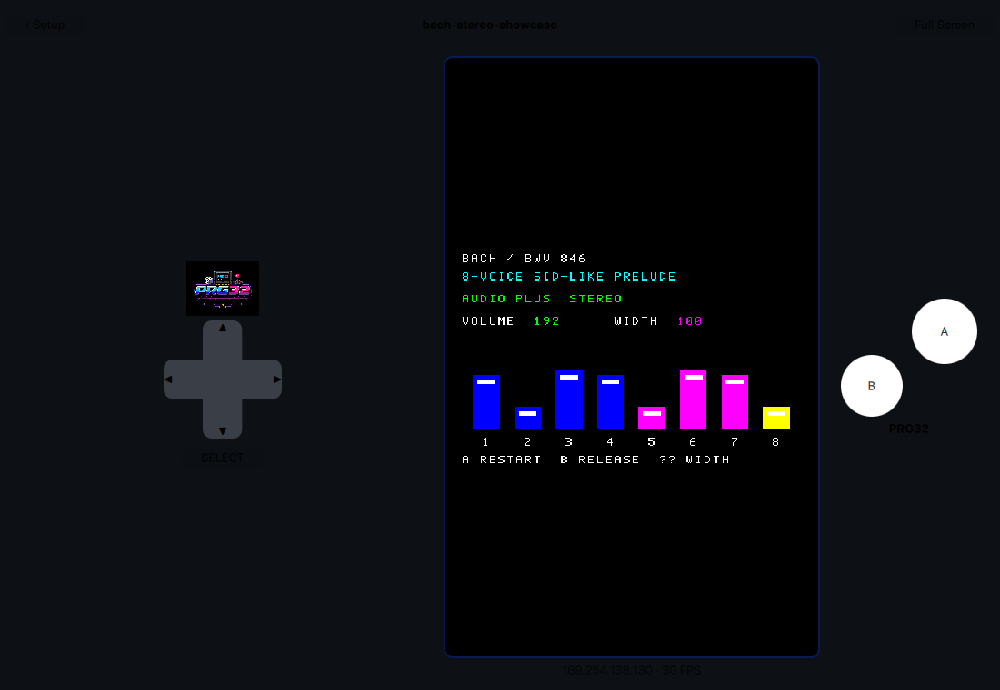 |

The shared Start/Select ABI control is centered below the game surface in landscape mode:

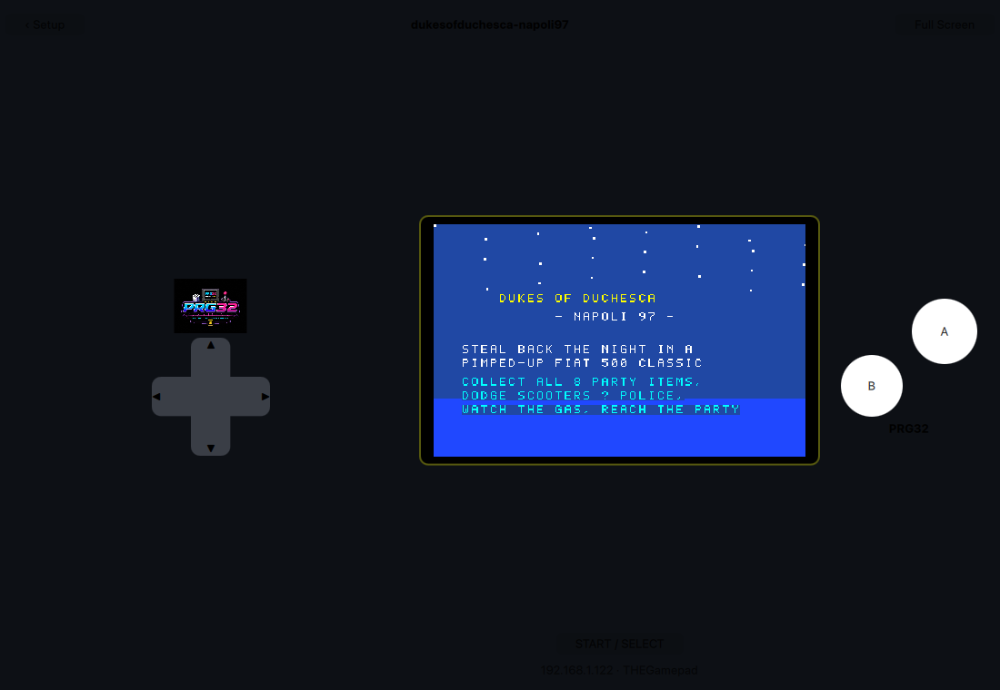

Spiriti's two-layer Naples playfield is included as a graphics regression capture:

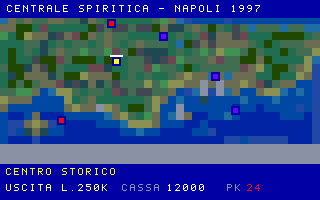

Physical iPhone 12 Pro Max captures confirm the native safe area in both orientations:

| Portrait Setup | Landscape Setup |
|---|---|
| 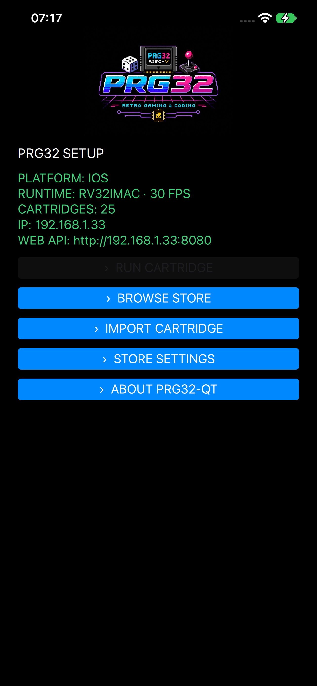 | 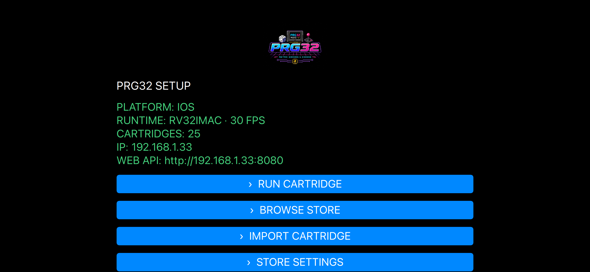 |

Desktop fullscreen removes all player chrome and touch controls:

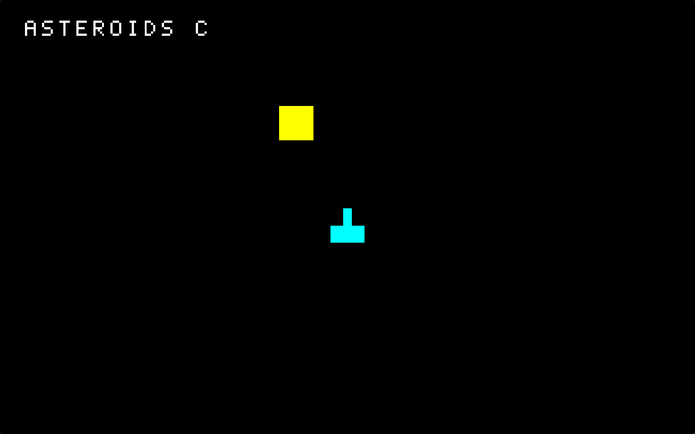

## Documentation

Project-level design and ownership documentation lives under `docs/`:

- [Vision](docs/VISION.md)
- [Architecture](docs/ARCHITECTURE.md)
- [iOS feature parity](docs/FEATURE_PARITY.md)
- [Platform support](docs/PLATFORMS.md)
- [Compatibility](docs/COMPATIBILITY.md)
- [Testing](docs/TESTING.md)
- [Licensing](docs/LICENSING.md)
- [Authorship](docs/AUTHORSHIP.md)
- [Third-party notices](docs/THIRD_PARTY_NOTICES.md)
- [Releasing](docs/RELEASING.md)

The repository-root `LICENSE` remains intentionally at the conventional GitHub location; licensing rationale and attribution are maintained in `docs/LICENSING.md` and `docs/AUTHORSHIP.md`.

## Contributing

See [CONTRIBUTING.md](CONTRIBUTING.md), [SECURITY.md](SECURITY.md), and [CODE_OF_CONDUCT.md](CODE_OF_CONDUCT.md). Compatibility changes should include regression coverage and, when Store behavior is affected, a whole-Store certification run.

### How this repository enforces its quality bar

The binding engineering contract is [AGENTS.md](AGENTS.md). GitHub Actions checks the repository's
authoritative `.clang-format`, documentation/code invariants, portable tests and fixture cartridges, all eight
supported build targets, and the live Cartridge Store catalog. Platform jobs call the scripts in `scripts/`, so
local and CI builds use the same entry points.
